# Project Timeline: Business Growth Operating System (BGOS)

This document contains our strict execution timeline mapping out the **24-hour national hackathon milestones** and future production cycles.

---

## ⏱️ Hackathon Schedule (24-Hour Plan)

To build the strongest technical product while keeping delivery achievable, we divide our 24-hour hackathon into four structural blocks:

```mermaid
gantt
    title Hackathon execution gantt (24-Hour Cycle)
    dateFormat  X
    axisFormat %H
    
    section Block 1: Architecture
    Design & Spec docs            :active, b1_1, 0, 4
    Database & API Setup          :active, b1_2, 3, 6
    
    section Block 2: Onboarding
    Discovery URL Scraper         :b2_1, 6, 9
    Adaptive Investigation Engine :b2_2, 8, 12
    
    section Block 3: Agents
    LangGraph Core Orchestration :b3_1, 12, 16
    Conflict Resolution Logic     :b3_2, 15, 18
    
    section Block 4: UI & Telemetry
    Dashboard Metric Telemetry    :b4_1, 18, 21
    Deployment & Polish           :b4_2, 20, 24
```

### 🟩 Block 1: Foundation & Specs (Hours 0 – 6)
* **Goal**: Establish core schemas, database engines, and structural directories.
* **Deliverables**:
  - Complete repository scaffolding with directory structures.
  - Set up PostgreSQL connection pooling and test ChromaDB local vector instance.
  - Implement basic FastAPI endpoints for discovery.

### 🟩 Block 2: Discovery & Investigation (Hours 6 – 12)
* **Goal**: Build dynamic website scraper and onboarding interview engine.
* **Deliverables**:
  - Implement request-based URL scraping converting HTML output to markdown format.
  - Build the dynamic question generator prompt utilizing Gemini.
  - Assemble Next.js frontend wizard UI mapping baseline parameters.

### 🟩 Block 3: Multi-Agent Collaboration (Hours 12 – 18)
* **Goal**: Build LangGraph workflow managing C-suite agents and decisions.
* **Deliverables**:
  - Define state charts in LangGraph managing transitions between CEO, Strategy, and Finance.
  - Construct prompt templates for all specialized roles.
  - Write conflict resolution loops checking for margin issues and distribution limits.

### 🟩 Block 4: Dashboard UI, BI & Demo Polish (Hours 18 – 24)
* **Goal**: Finalize BI charts, deploy pipelines, and Polish the user flow.
* **Deliverables**:
  - Connect Next.js dashboard charts to FastAPI metrics output.
  - Integrate Continuous Learning feedback loops updating parameters.
  - Deploy frontend to Vercel and backend server to Render.
  - Run full manual and scripted integration checks.
