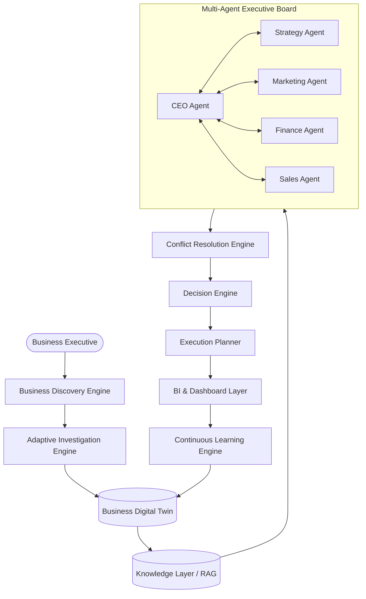

# Business Growth Operating System (BGOS) - Complete Technical Manual

This single reference manual compiles the entire text from all repository files (system specifications, architecture files, database designs, API schemas, and folder-specific READMEs) into a unified, continuous guide.

---

# PART 1: ROOT PORTAL & CORE FILES

## Root README
An autonomous AI Executive Operating System designed to understand businesses, generate strategies, coordinate multiple AI agents, execute complex workflows, measure outcomes, and continuously learn to optimize business growth.

BGOS is an enterprise-grade Executive Operating System that runs your business strategy like an autonomous executive board.

### Project Overview & Vision
The Business Growth Operating System (BGOS) is designed to address a critical operational failure: the execution gap between high-level business strategy and day-to-day operations. Rather than acting as a static record database (CRM) or a simple conversational chatbot, BGOS acts as a virtual C-Suite. It constructs a dynamic digital model of your business (the Business Digital Twin), analyzes operational data, debates growth opportunities across multiple specialized agents, and executes measurable workflows.

Small to mid-sized businesses (SMBs) and rapidly scaling startups often lack the resources to employ a comprehensive, specialized C-Suite (CMO, CFO, Strategy Directors). BGOS democratizes executive intelligence by providing a highly coordinated, explainable multi-agent system that analyzes data, simulates outcomes, resolves strategic conflicts, and delivers direct, actionable plans.

### The 5D Framework (Sponsor Alignment)
Our platform structure directly maps to the sponsor's 5D Framework for business growth:
1. Discover: Ingest company website, metadata, and initial documents to auto-generate a baseline schema.
2. Design: Conduct an adaptive, conversational investigation to resolve unknowns and refine business parameters.
3. Deliver: Formulate detailed, contextual marketing, sales, financial, and product growth strategies.
4. Develop: Execute strategic playbooks via specialized collaborative agents (CEO, CMO, CFO, Strategy, Sales).
5. Dominate: Continuously track metrics, run learning feedback loops, and outpace the market using real-time insights.

### Key Features
* Adaptive Business Discovery: Intelligent URL scraping and multi-turn conversational gap-filling instead of generic forms.
* Business Digital Twin: A real-time structured ontology representing metrics, margins, channels, and team constraints.
* Multi-Agent Executive Board: Specialized agents (CEO, CFO, CMO) that communicate, debate, and resolve strategic conflicts using structured game theory.
* Explainable Strategic Decisions: Every recommendation includes underlying evidence, assumptions, confidence scores, and alternative paths.
* Closed-Loop Continuous Learning: Automated feedback loops that measure execution metrics and update the digital twin parameters dynamically.

### Technology Stack
* Frontend: Next.js (App Router), React, TailwindCSS, Lucide Icons, Tremor/Chart.js.
* Backend: FastAPI, Pydantic (JSON validation), LangGraph (Agentic Orchestration).
* Database: PostgreSQL (Structured data & metadata), ChromaDB / pgvector (RAG vector index).
* AI Engine: Google Gemini (Inference, Embeddings, Structured JSON Outputs).
* Environment & Tools: Docker, GitHub Actions, Vercel, Render.

### System Architecture


### Repository Structure
```text
BusinessGrowthOS/
├── README.md                      # Main project portal
├── LICENSE                        # Apache 2.0 License
├── CONTRIBUTING.md                # Contribution workflow guidelines
├── CHANGELOG.md                   # Documented release milestones
├── SECURITY.md                    # Security policies and reporting
├── CODE_OF_CONDUCT.md             # Contributor guidelines
├── PROJECT_TIMELINE.md            # Hackathon & product schedule
├── DEVELOPMENT_GUIDELINES.md      # Development commands & setups
├── CODING_STANDARDS.md            # Standards, formatting, and linting
│
├── docs/                          # Detailed system design documents
│   ├── PROJECT_OVERVIEW.md
│   ├── PROBLEM_ANALYSIS.md
│   ├── SYSTEM_ARCHITECTURE.md
│   ├── BUSINESS_FLOW.md
│   ├── BUSINESS_DISCOVERY_ENGINE.md
│   ├── ADAPTIVE_INVESTIGATION_ENGINE.md
│   ├── BUSINESS_DIGITAL_TWIN.md
│   ├── KNOWLEDGE_LAYER.md
│   ├── MULTI_AGENT_ARCHITECTURE.md
│   └── ...
```

### Roadmap & Progress
- [x] Phase 1: Conceptualization, design system, and project scoping.
- [x] Phase 2: System Architecture definition & complete documentation.
- [/] Phase 3: FastAPI core infrastructure & database models configuration.
- [ ] Phase 4: Ingestive scraper and adaptive onboarding interface.
- [ ] Phase 5: LangGraph multi-agent board framework.
- [ ] Phase 6: BI Dashboard UI & Continuous Learning telemetry.

---

## Contributing Guidelines
Thank you for choosing to contribute to our AI Executive Operating System! We welcome all software engineers, enterprise architects, and product designers to help build the future of autonomous business growth.

### Development Setup & Standards
We maintain a strict code quality bar. Before submitting any changes, make sure your workspace matches our standards:
1. Frontend: Next.js App Router (React, TailwindCSS).
2. Backend: FastAPI (Python 3.11+, Pydantic v2).
3. Database: PostgreSQL and ChromaDB for vector operations.
4. Formatting & Linting:
   - Python: black for formatting, ruff for linting, and mypy for static type checking.
   - JavaScript/TypeScript: prettier and eslint.

Refer to CODING_STANDARDS.md for naming conventions and pattern requirements.

### Branching Strategy
Our git flow consists of:
* main: Protected production branch. Represents the stable released builds.
* staging: Protected integration testing branch. Pre-production validation.
* develop: Active integration branch. All feature branches merge here first.
* feature/issue-<ID>-<name>: Descriptive branches for specific features or bugs.

### Code Submission Process
1. Create a Feature Branch:
   ```bash
   git checkout develop
   git pull origin develop
   git checkout -b feature/issue-123-discovery-scraper
   ```
2. Commit with Conventional Commits:
   - `feat(discovery): add web scraping page parsing`
   - `fix(agent): repair LangGraph cycle loop lock`
   - `docs(api): document multi-agent execution endpoint`
3. Run Tests Locally: Ensure all Python and JS tests pass before pushing.
4. Submit a Pull Request (PR):
   - Target develop.
   - Complete the PR Template, linking the related GitHub Issue.
   - Require at least one approved code review from a Principal Engineer.
   - All CI checks (linting, building, tests) must pass.

### Testing Guidelines
Every pull request must contain appropriate test suites:
- Backend: Python pytest tests verifying APIs and models.
- Frontend: Playwright/Vitest assertions verifying UI elements.
- Agents: Mock LLM responses checking graph transitions in LangGraph.

Review the TESTING_STRATEGY.md file for more information.

---

## Project Timeline (24-Hour Plan)
This document contains our strict execution timeline mapping out the 24-hour national hackathon milestones and future production cycles.

```mermaid
gantt
    title Hackathon execution gantt (24-Hour Cycle)
    dateFormat  X
    axisFormat %H
    
    section Block 1: Architecture
    Design & Spec docs            :active, b1_1, 0, 4
    Database & API Setup          :active, b1_2, 3, 6
    
    section Block 2: Onboarding
    Discovery URL Scraper         :b2_1, 6, 9
    Adaptive Investigation Engine :b2_2, 8, 12
    
    section Block 3: Agents
    LangGraph Core Orchestration :b3_1, 12, 16
    Conflict Resolution Logic     :b3_2, 15, 18
    
    section Block 4: UI & Telemetry
    Dashboard Metric Telemetry    :b4_1, 18, 21
    Deployment & Polish           :b4_2, 20, 24
```



### Block 1: Foundation & Specs (Hours 0 – 6)
* Goal: Establish core schemas, database engines, and structural directories.
* Deliverables:
  - Complete repository scaffolding with directory structures.
  - Set up PostgreSQL connection pooling and test ChromaDB local vector instance.
  - Implement basic FastAPI endpoints for discovery.

### Block 2: Discovery & Investigation (Hours 6 – 12)
* Goal: Build dynamic website scraper and onboarding interview engine.
* Deliverables:
  - Implement request-based URL scraping converting HTML output to markdown format.
  - Build the dynamic question generator prompt utilizing Gemini.
  - Assemble Next.js frontend wizard UI mapping baseline parameters.

### Block 3: Multi-Agent Collaboration (Hours 12 – 18)
* Goal: Build LangGraph workflow managing C-suite agents and decisions.
* Deliverables:
  - Define state charts in LangGraph managing transitions between CEO, Strategy, and Finance.
  - Construct prompt templates for all specialized roles.
  - Write conflict resolution loops checking for margin issues and distribution limits.

### Block 4: Dashboard UI, BI & Demo Polish (Hours 18 – 24)
* Goal: Finalize BI charts, deploy pipelines, and Polish the user flow.
* Deliverables:
  - Connect Next.js dashboard charts to FastAPI metrics output.
  - Integrate Continuous Learning feedback loops updating parameters.
  - Deploy frontend to Vercel and backend server to Render.
  - Run full manual and scripted integration checks.

---

## Development Guidelines
This document details environment setup, local execution commands, testing scripts, and git workflows for the Business Growth Operating System (BGOS).

### Environment Setup
Prerequisites: Python 3.11+, Node.js 18.x+, PostgreSQL 15+, Docker (optional).

### 1. Backend Setup
1. Navigate to the backend directory: `cd backend`
2. Create and activate a virtual environment:
   ```bash
   python -m venv venv
   # On Windows:
   .\venv\Scripts\activate
   # On macOS/Linux:
   source venv/bin/activate
   ```
3. Install dependencies: `pip install -r requirements.txt`
4. Copy environment template: `cp .env.template .env`

### 2. Frontend Setup
1. Navigate to the frontend directory: `cd ../frontend`
2. Install node dependencies: `npm install`
3. Copy environment template: `cp .env.template .env.local`

### Running the System Locally
Start Databases (Docker Compose): `docker-compose up -d`
Start Backend Server: `uvicorn main:app --reload --port 8000`
Start Frontend Server: `npm run dev`

### Verification Commands
Run Python Tests: `pytest`
Run Frontend Linter & Tests: `npm run lint` and `npm run test`

---

## Coding Standards & Quality Matrix
This document outlines the strict style guides, architecture rules, and validation structures enforced across the codebase.

### Python Coding Standards (Backend & Agents)
We adhere to PEP 8 specifications with additional architectural restrictions:
* Modules/Packages: Lowercase letters, underscores permitted (`business_twin`, `agent_orchestrator`).
* Classes: PascalCase (`DiscoveryController`, `DecisionEngine`).
* Functions & Methods: snake_case (`resolve_conflict`, `generate_dynamic_question`).
* Variables & Constants: snake_case for local variables, UPPERCASE for constants (`MAX_ONBOARDING_QUESTIONS`).
* Type Hints: All function signatures must contain explicit type hints for both inputs and return parameters.
* Pydantic for Validation: All API boundaries and LLM structured outputs must pass through Pydantic classes to guarantee type safety.

### TypeScript/React Coding Standards (Frontend)
* Functional Components: All components must be functional components utilizing React hooks. Use explicit type declarations for props.
* Tailwinds & Layout CSS: Maintain layout classes in logical groups. Do not mix inline styles with TailwindCSS utilities unless dynamic calculation is required.

### Error Handling Policy
- Never return raw database errors or stack traces to the client. Wrap all operational errors in custom system exceptions.
- All LLM network failures should implement an exponential backoff retry loop (maximum 3 retries).

---

# PART 2: ARCHITECTURE & DETAILED SPECIFICATIONS

## Project Overview
The Business Growth Operating System (BGOS) is a dynamic, multi-agent AI ecosystem designed to act as an autonomous board of directors for enterprise growth. It sits above traditional operational tools (CRMs, ERPs, analytics databases) to provide strategic, explainable decision-making and automated workflow orchestration.

### Value Proposition
- Unified Growth Intelligence: Replaces fragmented dashboards with an executive board of specialized AI agents.
- Deep Context Alignment: Builds a high-fidelity Business Digital Twin mapping operations, unit economics, and constraints rather than isolated prompts.
- Explainable Decisions: Never outputs black-box advice. Every action plan is accompanied by structured evidence, specific operational assumptions, confidence intervals, and alternative strategies.
- Continuous Parameter Refinement: Telemetry from executed actions flows back into the Digital Twin, creating a self-improving strategic loop.

---

## Problem Analysis: Why Modern Business Growth Tools Fail
### 1. Passive Record Keeping (The CRM Trap)
Traditional CRMs are passive databases. They are excellent at recording what has happened, but they cannot formulate growth strategies. They place the analytical burden entirely on the human user, acting as digital filing cabinets rather than proactive strategic partners.

### 2. Isolated Chatbots (The Prompt Trap)
Placing generic LLM chat windows inside a CRM or operational portal does not solve business strategy.
- Context Fragmentation: Chatbots lack a structured understanding of the company's unit economics, operational boundaries, and competitor history.
- Hallucinated Action Plans: Lacking verification constraints, chatbots output generic, uncalibrated advice.

### 3. Dumb Dashboards (The Visualization Trap)
Standard Business Intelligence (BI) dashboards show charts without action directives. A user sees that churn is rising, but the dashboard does not answer "What should I do next?" or auto-coordinate the departments to resolve it.

---

## System Architecture: Platform Topology
### Platform Layers
1. Client Layer (Next.js & TailwindCSS):
   - Provides the interface for the baseline scraper and the multi-turn adaptive interview.
   - Renders the executive dashboard showing strategic metrics alongside the "What should I do next?" dynamic action feed.
   - Visualizes agent debate transcript streams to provide explainability.
2. Service Layer (FastAPI):
   - Handles authentication and user workspace permissions.
   - Ingests raw inputs (URLs, PDF documents, CSV spreadsheets) and manages the parsing pipeline.
   - Coordinates calls to the LangGraph core orchestrator.
3. Storage & Context Layer (PostgreSQL & ChromaDB):
   - PostgreSQL: Stores structured metadata, workspace states, task boards, and version history of the Business Digital Twin.
   - ChromaDB: Indexes chunked business files, competitor benchmark metrics, and playbooks.
4. Logic & Agentic Layer (LangGraph & Google Gemini):
   - Defines the conditional states, loops, and validation gates governing agent collaboration.
   - Runs the conflict resolution rules ensuring financial and operational constraints are respected.

---

## Business Flow Model: The 5D Growth Lifecycle
* Discover (Baseline Mapping): Ingest company website, metadata, and initial documents. Generate the Investigation Backlog listing missing metrics.
* Design (Adaptive Alignment): Conduct a 3-question adaptive interview, prompting the user for metrics like unit economics and goals. Build Digital Twin.
* Deliver (Collaborative Strategy): Generate complex, multi-agent growth recommendations. Summons CMO, CFO, and Strategy Agents to debate growth paths.
* Develop (Execution & Workflow): Convert recommendations into a detailed Kanban task board. Generate ready-to-use marketing copy, sales cadences, or landing page structures.
* Dominate (Telemetry & Learning): Analyze outcomes. Track task completion rates and update Twin parameters dynamically to optimize future plans.

---

## Business Discovery Engine: Ingestive Scraper
### 1. Ingestion Pipeline
- URL Scraper: Converts corporate page trees (landing, product, pricing, about pages) into clean, text-only markdown blocks.
- Enrichment: Query public DNS registries and WHOIS metadata.

### 2. Industry Ontology Classification
The system maps the scraped markdown content against a hierarchical business vertical ontology using structured LLM prompts. Key dimensions include:
* Industry Sector: e.g., B2B SaaS, HealthTech, D2C E-commerce.
* Monetization Model: e.g., recurring subscription, transactional fee, direct licensing.
* Scale Indicator: Estimated size derived from public references (employee tags, offices, product scopes).

---

## Adaptive Investigation Engine: Conversational Gap Resolution
### 1. Dynamic Question Generation
Questions are dynamically composed by the LLM based on vertical context and prior answers.

### 2. Validation & Business Consistency Checks
User inputs pass through a semantic logic layer checking for numerical range validation and consistency verification.

### 3. Terminating Conditions
- Maximum Questions Cap: Enforces a strict cap of 4 questions per session.
- Default Fallbacks: Unresolved gaps are populated with industry benchmark defaults, flagged as "Assumed" with low confidence scores.

---

## Business Digital Twin: The Structured Organization Model
The Business Digital Twin is the structured database model representing the company's metrics, policies, organizational structures, customer personas, and strategic constraints.

### Structure of the Twin
- FinancialProfile: monthly recurring revenue, monthly burn rate, gross margins, customer lifetime value.
- MarketingMetrics: customer acquisition cost, acquisition channels, conversion rates.
- SalesPipeline: sales rep count, average deal cycle, close ratio.
- OperationalConstraints: monthly ad budget cap, engineering capacity, regulatory compliance.

### Versioning & Historical Tracking
- State Snapshot: Every twin configuration is stored as a row in the database, tracking changes over time.
- Historical Analysis: Allows the Data Analyst Agent to query previous metrics to identify trends.
- Confidence Metrics: Each variable includes a confidence flag.

---

## Knowledge Layer (RAG): Contextual Retrieval Pipeline
The Knowledge Layer serves as the system's memory, indexing internal corporate files and external benchmarks to provide semantic context.

### 1. Ingestion & Preprocessing
* Text Extraction: Runs PDF-to-Text and structural layout analysis.
* Semantic Sectional Chunking: Identifies structural layout breaks to split documents into logical segments rather than fixed character counts.

### 2. Retrieval & Context Composition
1. Semantic Querying: cosine similarity matching in ChromaDB.
2. Access Control Filtering: metadata filter evaluates document access levels.
3. Retrieval Composition: retrieved chunks are merged and injected into prompt context.

---

## Multi-Agent Architecture: The Autonomous Executive Board
* CEO Agent (Chief Executive Officer): Orchestrates the executive board, manages consensus, and drives final strategic selections. Primary decision power.
* Strategy Agent (Chief Strategy Officer): Formulates high-level growth strategies and coordinates market positioning. Recommender power.
* Marketing Agent (Chief Marketing Officer): Develops customer acquisition and campaign strategies. Outputs ad budgets and copy templates.
* Finance Agent (Chief Financial Officer): Guards unit economics, margins, and burn rate boundaries. Veto power over marketing budgets.
* Sales Agent (Chief Revenue Officer): Designs sales pipelines and outbound outreach cadences. Outputs sales outreach playbooks.
* Operations Agent (Chief Operating Officer): Identifies bottleneck constraints and aligns resources. Operational feasibility rating power.
* Data Analyst Agent: Queries telemetry data and validates performance. Logs performance indicators.

---

## Agent Communication Protocols: Message & State Passing
Agents communicate via structured, schema-validated message networks utilizing LangGraph state channels.
The LangGraph workflow maintains a central, mutable state dictionary:
```python
class BoardState(TypedDict):
    company_id: str
    target_goal: str
    proposals: List[Dict[str, Any]]
    feedback_logs: List[str]
    vetoes: List[str]
    approved_plan: Dict[str, Any]
```
Agents exchange structured objects containing sender, intent, content, data payload metrics, confidence score, and evidence citations.

---

## Decision Engine & Conflict Resolution
The Decision Engine resolves competing recommendations from specialized agents to compile a final strategic initiative.

### Decision Mechanics & Constraints Verification
- Financial Hard Gates (CFO Vetoes): Any recommendation that decreases the runway below 6 months is vetoed. Pricing proposals must maintain gross margins above thresholds.
- Operational Feasibility Checks: COO agent checks capacity limits.
- Recommendation Compilation Output: Outputs selected initiative, underlying assumptions, confidence rating, and alternative plans.

---

## Execution Engine: Workflow Planner & Asset Generator
The Execution Engine translates high-level strategic decisions into actionable tasks, automatically generating required assets.

### 1. Kanban Task Generation
Decomposes a strategy into a set of sequential tasks, populating title, owner agent, action steps, and context asset links.

### 2. Auto-Asset Copywriting Engine
- Email Sequences: Generates 3-touchpoint cold emails utilizing AIDA or PAS copywriting frameworks.
- Ad Frameworks: Creates ad headlines and body copy structured for Google and Meta.
- Landing Page Structures: Generates markdown structures containing section titles, headers, and call to actions.

---

## Continuous Learning Engine: Self-Optimizing Feedback Loops
The Continuous Learning Engine evaluates execution telemetry and updates the Digital Twin parameters dynamically.

### 1. Telemetry Ingestion
- Evaluates ad spend results, conversion numbers, open rates, and click rates.
- Week-by-week metric synchronizations.

### 2. Parameter Recalibration & Attribution
Adjusts metrics when actual variance exceeds predicted bounds. Documents target metric, variance, attribution rationale, and action directives.

---

## AI Explainability: Transparent Business Logic
To build trust with executives, BGOS operates under a strict Explainable AI (XAI) mandate:
1. Vector Evidence: Strategy recommendations contain direct references to vector store document chunks or twin variables.
2. Operational Assumptions: Lists logical and performance assumptions required.
3. Confidence Metrics: Evaluates data completeness and validation constraints.
4. Strategic Alternatives: Compiles alternate strategy paths (Plan B) if assumptions fail.

---

# PART 3: SCHEMAS & PLATFORM README INTEGRATIONS

## Database Design Schema
```sql
-- Core schemas mapping Postgres layout
CREATE TABLE users (
    id UUID PRIMARY KEY DEFAULT gen_random_uuid(),
    email VARCHAR(255) UNIQUE NOT NULL,
    password_hash VARCHAR(255) NOT NULL,
    full_name VARCHAR(255) NOT NULL,
    created_at TIMESTAMP WITH TIME ZONE DEFAULT CURRENT_TIMESTAMP
);

CREATE TABLE businesses (
    id UUID PRIMARY KEY DEFAULT gen_random_uuid(),
    owner_id UUID REFERENCES users(id) ON DELETE CASCADE,
    company_name VARCHAR(255) NOT NULL,
    website_url VARCHAR(255),
    created_at TIMESTAMP WITH TIME ZONE DEFAULT CURRENT_TIMESTAMP
);

CREATE TABLE business_profiles (
    id UUID PRIMARY KEY DEFAULT gen_random_uuid(),
    business_id UUID REFERENCES businesses(id) ON DELETE CASCADE,
    version_id INT NOT NULL,
    industry_vertical VARCHAR(100) NOT NULL,
    financial_data JSONB NOT NULL,
    marketing_data JSONB NOT NULL,
    sales_data JSONB NOT NULL,
    constraints JSONB NOT NULL,
    is_active BOOLEAN DEFAULT TRUE,
    created_at TIMESTAMP WITH TIME ZONE DEFAULT CURRENT_TIMESTAMP
);

CREATE TABLE knowledge_documents (
    id UUID PRIMARY KEY DEFAULT gen_random_uuid(),
    business_id UUID REFERENCES businesses(id) ON DELETE CASCADE,
    filename VARCHAR(255) NOT NULL,
    file_type VARCHAR(50) NOT NULL,
    access_level VARCHAR(50) DEFAULT 'GENERAL',
    chroma_collection_name VARCHAR(100) NOT NULL,
    created_at TIMESTAMP WITH TIME ZONE DEFAULT CURRENT_TIMESTAMP
);
```

---

## API Design Specifications
- `POST /api/v1/auth/register`: Register User.
- `POST /api/v1/auth/token`: Login User.
- `POST /api/v1/discovery/ingest`: Ingest URL & initiate scraping.
- `GET /api/v1/discovery/questions`: Retrieve dynamic onboarding questions.
- `POST /api/v1/analysis/execute`: Trigger multi-agent strategy planning cycle.
- `GET /api/v1/dashboard/metrics`: Fetch telemetry metrics.
- `POST /api/v1/knowledge/upload`: Upload business documents to vector index.

---

## Deployment Architecture
- Cloudflare WAF $\rightarrow$ Vercel (Next.js App Router) $\rightarrow$ Render (FastAPI Docker Backend) $\rightarrow$ Supabase (Managed Postgres) & pgvector/ChromaDB.
- Environments: Development (Local), Staging (Pre-release), Production (Live).
- CI/CD Github Actions: automated linting, test suites run, and docker build deployment triggers.

---

## Security Architecture
- Logical multi-tenancy schema isolation utilizing token-derived `tenant_id` validation.
- AES-256 Postgres filesystem encryption, application-level field encryption for sensitive numbers.
- Personal Identifiable Information (PII) extraction and redaction before LLM dispatch.

---

## Dashboard Design
- Renders growth metrics cards (MRR, CAC, Runway) alongside the dynamic Action Feed card lists.
- Renders the explainable Agent Debate Log window showing real-time multi-agent negotiation transcripts.

---

## Testing Strategy
- Unit Tests: `pytest` verifying scrapers and schema parsing models.
- Integration Tests: Client-server interaction tests and JWT authorization checks.
- Agentic Workflow Tests: Mocking Gemini model endpoints and asserting LangGraph state channel transitions.

---

# PART 4: DIRECTORY READMES

## Frontend README (`/frontend/README.md`)
This directory contains the Next.js App Router client application for the Business Growth Operating System (BGOS).

### Folder Structure
- `app/`: Router layouts, onboarding, dashboard pages.
- `components/`: UI widgets and agent debate logs.
- `hooks/`: socket listeners and session controllers.
- `lib/`: config values and client validations.
- `package.json`: build triggers and package specifications.

### Scripts
- `npm run dev`: Start local dev server.
- `npm run build`: Compile static files.
- `npm run lint`: Verify code quality checks.

---

## Backend README (`/backend/README.md`)
This directory contains the FastAPI server code for the Business Growth Operating System (BGOS).

### Folder Structure
- `app/main.py`: Entrypoint routes mapping.
- `app/api/`: Routing endpoints folders.
- `app/services/`: Scraper services, database utilities, orchestrators.
- `app/models/`: SQLAlchemy ORM mapping and Pydantic schemas.
- `requirements.txt`: library references.
- `.env.template`: configuration file templates.

---

## Agents README (`/agents/README.md`)
Organizes specialized C-Suite AI roles into structured debate and decision-making configurations using LangGraph state charts.

### Folder Structure
- `state.py`: Shared state schema dictionary.
- `graph.py`: LangGraph state chart loops logic.
- `roles/`: ceo, cfo, cmo, cro, and cso node modules.
- `utils/`: conflict resolution tools and helper variables.

---

## Prompts README (`/prompts/README.md`)
Contains the prompt templates and output verification schemas used across the platform to guarantee consistent LLM outputs.

### Folder Structure
- `discovery/`: industry classifier and gap detector templates.
- `onboarding/`: question composer layouts.
- `agents/`: ceo, cfo, and cmo system instructions.
- `schemas/`: pydantic JSON schema templates.

---

## Database README (`/database/README.md`)
Contains the database tables, initialization scripts, migrations, and seed data configurations for PostgreSQL.
Managed using Alembic migration tools. Commands:
- `alembic init migrations`: Initialize migration tracker.
- `alembic revision --autogenerate -m "init_schema"`: Create schema diff script.
- `alembic upgrade head`: Execute updates.

---

## Knowledge README (`/knowledge/README.md`)
Contains the pipeline code for RAG (Retrieval-Augmented Generation) document parsing, embedding generation, and ChromaDB vector indexing.
- `ingestion.py`: Document layout parser.
- `embedder.py`: Coordinates embedding queries.
- `store.py`: ChromaDB collection control.

---

## Tests README (`/tests/README.md`)
Contains automated verification test suites for unit, integration, and agentic checks.
- `conftest.py`: Shared mock database and LLM fixtures.
- `unit/`: functions validation.
- `integration/`: HTTP endpoint checks.
- `agentic/`: LangGraph node checks.
- Executed using `pytest`.
