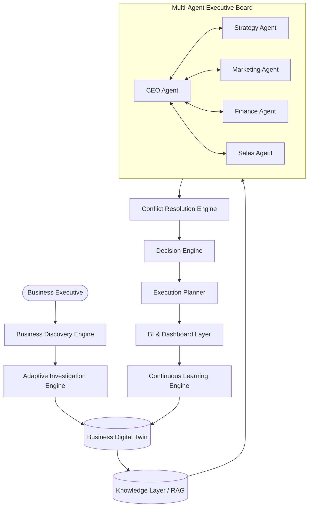
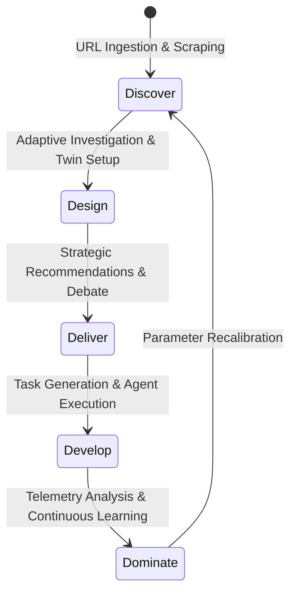
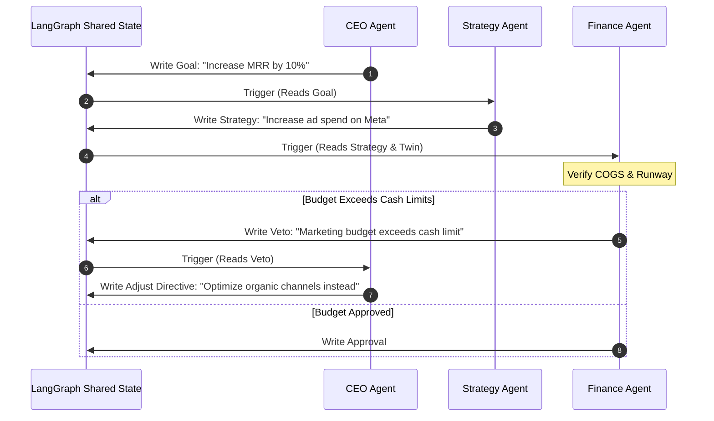

# Platform Architecture Diagrams

This repository acts as the central hub for all Mermaid diagram sources mapping the platform topologies and operations of the Business Growth Operating System (BGOS).

---

## 🗺️ Master Platform Architecture

---

## 🔄 Business Flow lifecycle

---

## 💬 Agent Communication & Debate Flow

