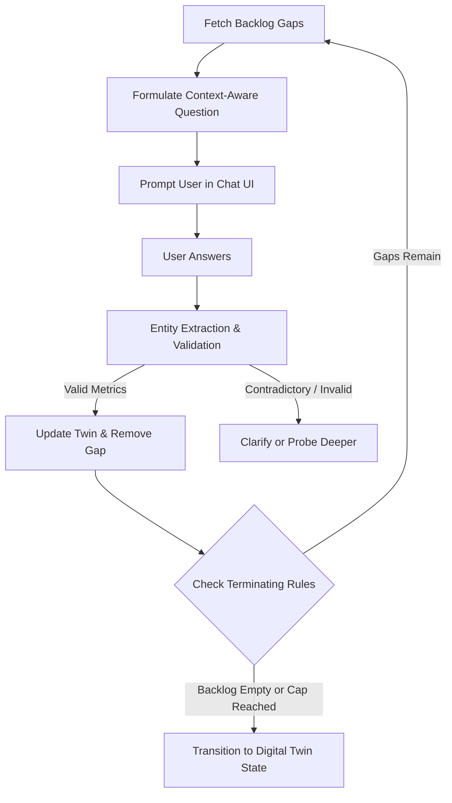

# Adaptive Investigation Engine: Conversational Gap Resolution

The **Adaptive Investigation Engine** conducts a dynamic, context-aware interview with the business owner to resolve the unknown variables flagged in the Discovery Engine's **Investigation Backlog**.

---

## ⚙️ Conversational Workflow

---

## 🛠️ Detailed Specifications

### 1. Dynamic Question Generation
Questions are dynamically composed by the LLM based on:
* **The Vertical Context**: If B2B SaaS, the system asks about Average Contract Value (ACV) and sales cycle duration. If D2C, it asks about Average Order Value (AOV) and return rates.
* **Prior Answers**: Subsequent questions reference previously provided figures to maintain a natural, coherent dialogue (e.g. "Since your monthly ad spend is $10k, how much of that is allocated to Meta vs Google?").

### 2. Validation & Business Consistency Checks
User inputs pass through a semantic logic layer:
- **Numerical Validation**: E.g., ensuring percentages are within $0-100\%$, ratios are positive, and values conform to general scales.
- **Consistency Verification**: If the user reports a monthly revenue of \$50,000 but a monthly burn of \$60,000 with only \$10,000 in bank reserves, the engine flags a burn rate alert and prompts: "It looks like your burn exceeds your revenue. Do you have external funding or capital reserves?"

### 3. Terminating Conditions
To maximize user experience and demo impact during the hackathon:
- **Maximum Questions Cap**: The engine enforces a strict cap of **4 questions** per session.
- **Default Fallbacks**: Gaps that remain unresolved are populated with logical defaults based on industry benchmarks, flagged as "Assumed" with low confidence scores in the Digital Twin.
