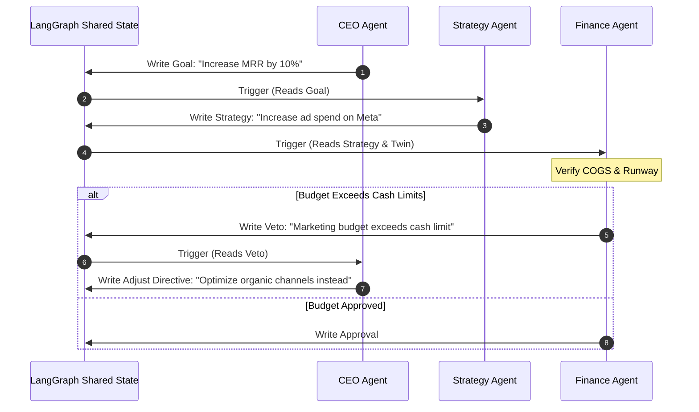

# Agent Communication Protocols: Message & State Passing

Specialized agents in the Business Growth Operating System (BGOS) communicate via structured, schema-validated message networks utilizing LangGraph state channels.

---

## ⚙️ Communication Topology



---

## 🛠️ Communication Implementation Specifications

### 1. LangGraph Shared State Channels
The LangGraph workflow maintains a central, mutable state dictionary (schema-validated by Pydantic) that nodes read from and write to:
```python
from typing import TypedDict, List, Dict, Any

class BoardState(TypedDict):
    company_id: str
    target_goal: str
    proposals: List[Dict[str, Any]]
    feedback_logs: List[str]
    vetoes: List[str]
    approved_plan: Dict[str, Any]
```

### 2. Message Formats
Agents exchange structured objects containing:
- `sender`: Agent name (`cfo`, `cmo`).
- `intent`: Action class (`PROPOSAL`, `FEEDBACK`, `VETO`, `APPROVAL`).
- `content`: Unstructured explanation.
- `data`: Structured payload metrics (e.g., proposed budget, projected CPA).
- `confidence`: Confidence score indicator ($0-1.0$).
- `evidence`: Citations to vector store chunks or twin parameters.
