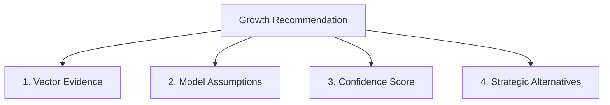

# AI Explainability: Transparent Business Logic

To build trust with executives, the Business Growth Operating System (BGOS) operates under a strict **Explainable AI (XAI)** mandate. The system never outputs standalone recommendations. Every strategy or task must be supported by transparent reasoning.

---

## 🏛️ The Four Pillars of BGOS Explainability

### 1. Vector Evidence (Knowledge Citations)
Any strategy must include references to the data sources that justified it:
- **Internal Sources**: e.g., "Based on page 4 of the Q2 Financial deck, your customer acquisition budget has a surplus."
- **External Benchmarks**: e.g., "According to SaaS Capital 2025 reports, a Gross Margin of 70% is standard for early-stage B2B SaaS."

### 2. Operational Assumptions
The engine lists the assumptions required for the recommendation to succeed:
- "This pricing model assumes a monthly conversion rate of 2% or higher."
- "Assumes that CAC remains under $50 per user on Meta Ads."

### 3. Confidence Metrics
We score the confidence of recommendations using two coordinates:
* **Data Completeness**: Measured by the completion percentage of the Digital Twin profile.
* **Metric Confidence**: Based on whether parameters were manually validated or estimated using defaults.

### 4. Strategic Alternatives (Alternatives Scenarios)
The system presents alternative strategic routes:
* **Selected Path**: e.g., Meta Ad Campaign.
* **Alternative Path**: e.g., Organic LinkedIn outreach if CAC on Meta exceeds target bounds.
