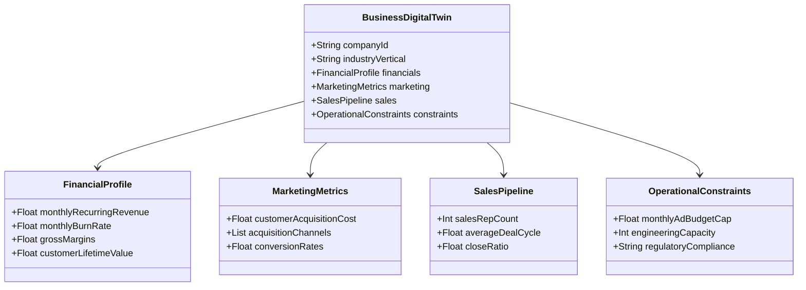

# Business Digital Twin: The Structured Organization Model

The **Business Digital Twin** is the structured database model representing the company's metrics, policies, organizational structures, customer personas, and strategic constraints. It acts as the single source of truth for the Agent Collaboration Layer.

---

## 🏗️ Structure of the Twin

The Digital Twin separates organizational states into distinct schema domains:

---

## 🔄 Versioning & Historical Tracking

The Digital Twin is versioned. When recommendations are executed and telemetry changes occur (e.g. ad spend leads to higher conversions), a new version of the twin is saved in the database:

- **State Snapshot**: Every twin configuration is stored as a row in the database, tracking changes over time.
- **Historical Analysis**: Allows the Data Analyst Agent to query previous metrics to identify trends, e.g., "CAC has decreased by 15% since running campaign V2."
- **Confidence Metrics**: Each variable includes a confidence flag (e.g., `value: 120, confidence: "VERIFIED"` vs. `value: 150, confidence: "ASSUMED"`), prompting the Adaptive Investigation Engine to update assumed values when possible.
