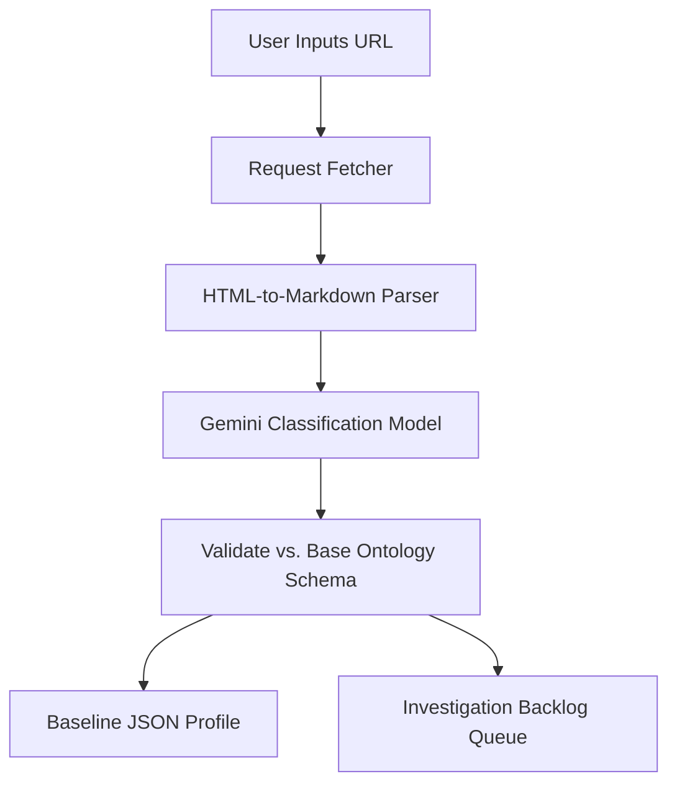

# Business Discovery Engine: Ingestive Scraper

The **Business Discovery Engine** maps the target company's industry, core product offerings, target audience, and business model using raw, low-friction user inputs.

---

## ⚙️ Ingestion & Parsing Workflow

---

## 🛠️ Detailed Specifications

### 1. Ingestion Pipeline
- **URL Scraper**: Converts corporate page trees (landing, product, pricing, about pages) into clean, text-only markdown blocks, stripping scripts, stylesheets, and navigation templates.
- **Enrichment**: Query public DNS registries and WHOIS metadata to determine domain registration timelines and hosting stack indicators.

### 2. Industry Ontology Classification
The system maps the scraped markdown content against a hierarchical business vertical ontology using structured LLM prompts. Key dimensions include:
* **Industry Sector**: e.g., B2B SaaS, HealthTech, D2C E-commerce.
* **Monetization Model**: e.g., recurring subscription, transactional fee, direct licensing.
* **Scale Indicator**: Estimated size derived from public references (employee tags, offices, product scopes).

### 3. Output Schema & Backlog Generation
The engine outputs:
1. **Baseline Profile (JSON)**: Extracted categories mapped to standard twin fields.
2. **Investigation Backlog (JSON List)**: Missing key growth variables (e.g. "Pricing values detected but margin profiles undefined").
