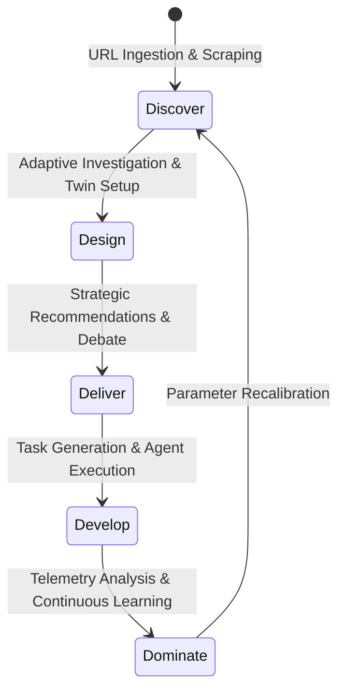

# Business Flow Model: The 5D Growth Lifecycle

The Business Growth Operating System (BGOS) runs on a progressive execution loop called the **5D Framework**. This framework guides the user from raw ingestion to autonomous optimization.

---

## 🗺️ The 5D Framework Flow

---

## 🔍 Detailed Framework Phases

### 1. Discover (Baseline Mapping)
* **Objective**: Establish the initial structural profile of the business with zero user friction.
* **Activities**: 
  - User submits corporate URL.
  - Discovery Engine crawls public data, extracting industry category, value proposition, and key products.
  - System generates the **Investigation Backlog** listing missing metrics.

### 2. Design (Adaptive Alignment)
* **Objective**: Fill the backlog gaps conversational and build a high-fidelity Digital Twin.
* **Activities**:
  - System conducts a 3-question adaptive interview, prompting the user for metrics like unit economics and goals.
  - User responses are validated against business logic.
  - The **Business Digital Twin** is initialized in the database.

### 3. Deliver (Collaborative Strategy)
* **Objective**: Generate complex, multi-agent growth recommendations.
* **Activities**:
  - The **CEO Agent** summons the CMO, CFO, and Strategy Agents.
  - Agents debate growth paths (e.g. ad campaigns vs pricing changes), checking constraints.
  - A structured recommendation bundle is output, outlining evidence, risks, assumptions, and alternatives.

### 4. Develop (Execution & Workflow)
* **Objective**: Translate strategic choices into structured operational work.
* **Activities**:
  - The Execution Planner converts recommendations into a detailed Kanban task board.
  - AI agents generate ready-to-use marketing copy, sales cadences, or landing page structures.
  - User approves and pushes tasks to integration platforms (Trello, Slack).

### 5. Dominate (Telemetry & Learning)
* **Objective**: Analyze outcomes and continuously refine the system.
* **Activities**:
  - System tracks task completion rates and business metrics (e.g., changes in CAC/LTV).
  - The Continuous Learning Engine compares performance against predictions.
  - The Digital Twin's parameters (e.g., conversion rate) are updated to optimize future plans.
