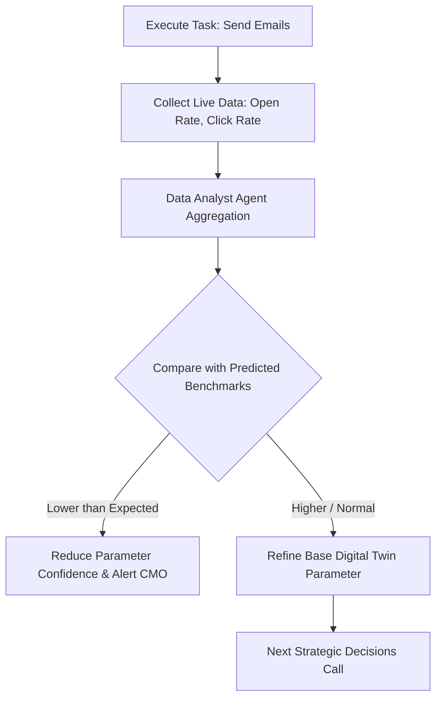

# Continuous Learning Engine: Self-Optimizing Feedback Loops

The **Continuous Learning Engine** ensures that the Business Growth Operating System (BGOS) is not static. It continuously evaluates execution telemetry (e.g., ad spend results, sales conversion numbers) and feeds these outcomes back into the Digital Twin, refining future strategic planning.

---

## 🔄 Telemetry & Learning Feedback Loop

---

## 🛠️ Detailed Specifications

### 1. Telemetry Data Ingestion
- In the MVP, developers simulate telemetry inputs (e.g. mock CSV uploads or dashboard sliders representing ad performance: CPC, impressions, conversions).
- In the enterprise system, the Data Analyst Agent queries connected dashboards (Google Analytics, Stripe, HubSpot) to gather weekly performance logs.

### 2. Digital Twin Parameter Recalibration
- **Parameter Adjustments**: If the digital twin assumes a conversion rate of `2.0%` but telemetry over 30 days reports `1.2%`, the engine adjusts the twin metric.
- **Runway Recalculations**: Actual burn rates and revenues are synchronized weekly, triggering warning status flags if cash runway drops near critical zones.

### 3. Explainable Performance Attribution
The engine documents performance details:
* **The Target Metric**: e.g., CPA (Cost Per Acquisition).
* **The Variance**: e.g., "Predicted: $40, Actual: $52 (Variance: +30%)".
* **Attribution Rationale**: The Data Analyst Agent runs a prompt to explain *why* the variance occurred, e.g., "Google ad budget fatigue occurred due to narrow keyword matching."
* **Action Directive**: Recommends adjusting ad targets or changing budgets.
