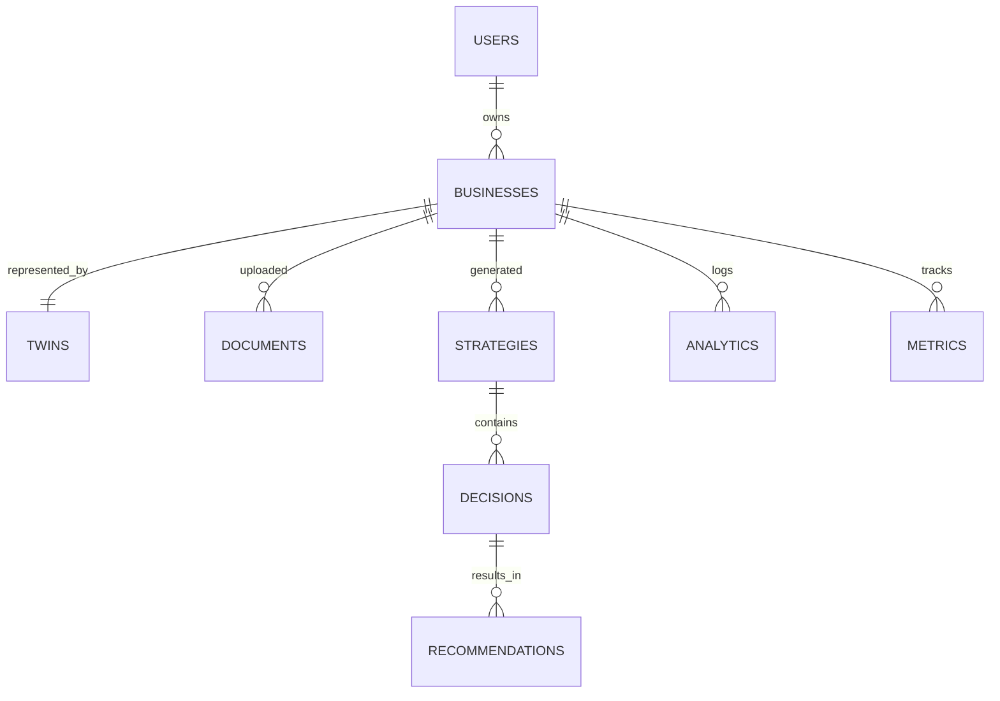

# Database Design Schema

This document outlines the relational database schema of the Business Growth Operating System (BGOS), defining the tables, columns, constraints, and relationships that persist system state.

---

## 🏗️ Entity Relationship Diagram



---

## 🛠️ Table Specifications

### 1. `users`
Persists core application users:
```sql
CREATE TABLE users (
    id UUID PRIMARY KEY DEFAULT gen_random_uuid(),
    email VARCHAR(255) UNIQUE NOT NULL,
    password_hash VARCHAR(255) NOT NULL,
    full_name VARCHAR(255) NOT NULL,
    created_at TIMESTAMP WITH TIME ZONE DEFAULT CURRENT_TIMESTAMP
);
```

### 2. `businesses`
Represents customer organizations:
```sql
CREATE TABLE businesses (
    id UUID PRIMARY KEY DEFAULT gen_random_uuid(),
    owner_id UUID REFERENCES users(id) ON DELETE CASCADE,
    company_name VARCHAR(255) NOT NULL,
    website_url VARCHAR(255),
    created_at TIMESTAMP WITH TIME ZONE DEFAULT CURRENT_TIMESTAMP
);
```

### 3. `business_profiles` (Digital Twin Snapshots)
Versioned state parameters of the company:
```sql
CREATE TABLE business_profiles (
    id UUID PRIMARY KEY DEFAULT gen_random_uuid(),
    business_id UUID REFERENCES businesses(id) ON DELETE CASCADE,
    version_id INT NOT NULL,
    industry_vertical VARCHAR(100) NOT NULL,
    financial_data JSONB NOT NULL, -- e.g., MRR, COGS, Cash reserves
    marketing_data JSONB NOT NULL, -- e.g., Channels, CAC, Conversions
    sales_data JSONB NOT NULL,     -- e.g., Funnels, Cycles
    constraints JSONB NOT NULL,     -- e.g., Budget caps, headcounts
    is_active BOOLEAN DEFAULT TRUE,
    created_at TIMESTAMP WITH TIME ZONE DEFAULT CURRENT_TIMESTAMP
);
```

### 4. `knowledge_documents`
Metadata for files uploaded by the business:
```sql
CREATE TABLE knowledge_documents (
    id UUID PRIMARY KEY DEFAULT gen_random_uuid(),
    business_id UUID REFERENCES businesses(id) ON DELETE CASCADE,
    filename VARCHAR(255) NOT NULL,
    file_type VARCHAR(50) NOT NULL,
    access_level VARCHAR(50) DEFAULT 'GENERAL',
    chroma_collection_name VARCHAR(100) NOT NULL,
    created_at TIMESTAMP WITH TIME ZONE DEFAULT CURRENT_TIMESTAMP
);
```

### 5. `strategies`
High-level strategic plans debated by the board:
```sql
CREATE TABLE strategies (
    id UUID PRIMARY KEY DEFAULT gen_random_uuid(),
    business_id UUID REFERENCES businesses(id) ON DELETE CASCADE,
    goal_statement TEXT NOT NULL,
    status VARCHAR(50) DEFAULT 'PLANNING', -- PLANNING, APPROVED, COMPLETED
    created_at TIMESTAMP WITH TIME ZONE DEFAULT CURRENT_TIMESTAMP
);
```

### 6. `agent_decisions`
Agent-specific votes, proposals, or vetoes within a strategy:
```sql
CREATE TABLE agent_decisions (
    id UUID PRIMARY KEY DEFAULT gen_random_uuid(),
    strategy_id UUID REFERENCES strategies(id) ON DELETE CASCADE,
    agent_role VARCHAR(50) NOT NULL, -- ceo, cfo, cmo
    decision_type VARCHAR(50) NOT NULL, -- PROPOSAL, VETO, APPROVAL
    rationale TEXT NOT NULL,
    metrics_payload JSONB,
    created_at TIMESTAMP WITH TIME ZONE DEFAULT CURRENT_TIMESTAMP
);
```

### 7. `recommendations`
Specific actionable steps arising from approved strategies:
```sql
CREATE TABLE recommendations (
    id UUID PRIMARY KEY DEFAULT gen_random_uuid(),
    strategy_id UUID REFERENCES strategies(id) ON DELETE CASCADE,
    title VARCHAR(255) NOT NULL,
    action_description TEXT NOT NULL,
    confidence_score FLOAT NOT NULL,
    assumptions JSONB NOT NULL,
    alternatives JSONB NOT NULL,
    created_at TIMESTAMP WITH TIME ZONE DEFAULT CURRENT_TIMESTAMP
);
```

### 8. `analytics`
Activity logs and history of execution:
```sql
CREATE TABLE analytics (
    id UUID PRIMARY KEY DEFAULT gen_random_uuid(),
    business_id UUID REFERENCES businesses(id) ON DELETE CASCADE,
    action_type VARCHAR(100) NOT NULL,
    details JSONB NOT NULL,
    created_at TIMESTAMP WITH TIME ZONE DEFAULT CURRENT_TIMESTAMP
);
```

### 9. `dashboard_metrics`
Aggregated values to feed the BI dashboard interface:
```sql
CREATE TABLE dashboard_metrics (
    id UUID PRIMARY KEY DEFAULT gen_random_uuid(),
    business_id UUID REFERENCES businesses(id) ON DELETE CASCADE,
    metric_name VARCHAR(100) NOT NULL,
    metric_value FLOAT NOT NULL,
    timestamp TIMESTAMP WITH TIME ZONE DEFAULT CURRENT_TIMESTAMP
);
```
