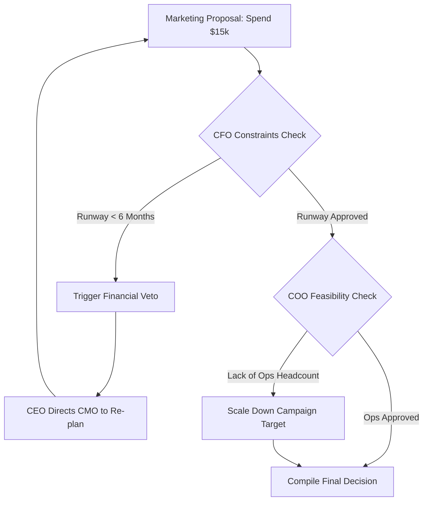

# Decision Engine & Conflict Resolution

The **Decision Engine** resolves competing recommendations from specialized agents to compile a final strategic initiative. It acts as the logic gatekeeper before any plan is sent to the Execution Planner.

---

## ⚙️ Conflict Resolution Loop

---

## 🛠️ Decision Mechanics & Constraints Verification

All proposals are evaluated against strict operational constraints loaded from the Digital Twin:

### 1. Financial Hard Gates (CFO Vetoes)
- **Runway Rule**: Any recommendation that decreases the company's cash runway below **6 months** (calculated as `Cash Reserves / Monthly Burn`) is automatically vetoed by the CFO Agent.
- **Gross Margin Rule**: Pricing proposals must maintain a gross margin above the **minimum margin limit** (e.g. 60% for SaaS, 30% for retail).

### 2. Operational Feasibility Checks (COO Verification)
- **Capacity Limits**: If a proposal requires content generation beyond the team's capacity parameters, the COO Agent flags the deficit, instructing the system to scale down the scope or add outsourcing tasks to the execution backlog.

### 3. Recommendation Compilation Output
A decision is finalized only when all agents sign off. The final output is structured as:
* **The Selected Initiative**: Action statements.
* **Underlying Assumptions**: Operational values expected (e.g., "Assumes a conversion rate of 2% on Meta ads").
* **Confidence Rating**: Categorized as `HIGH`, `MEDIUM`, or `LOW`.
* **Alternative Scenarios**: Alternate plans considered (e.g., "Plan B: Run email referral campaign if Meta CPC exceeds $3.00").
