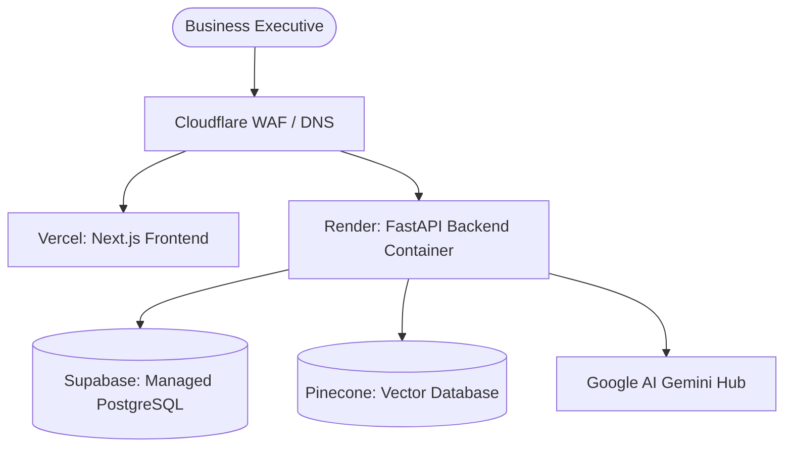

# Deployment Architecture: Infrastructure & Pipeline

This document defines the hosting topologies, CI/CD pipeline parameters, and monitoring frameworks for the Business Growth Operating System (BGOS).

---

## 🏗️ Platform Topology

---

## 📂 Configuration Environments

The platform operates across three isolated environments:

| Environment | Host (Frontend) | Host (Backend) | Databases |
| :--- | :--- | :--- | :--- |
| **Development** | Local (`localhost:3000`) | Local (`localhost:8000`) | Docker (PostgreSQL & ChromaDB) |
| **Staging** | Vercel (`staging.bgos.ai`) | Render Private Web Service | Supabase Sandbox & pgvector |
| **Production** | Vercel (`app.bgos.ai`) | Render Autoscaling Cluster | Supabase Production & Pinecone |

---

## 🔄 CI/CD Pipelines (GitHub Actions)

When a developer pushes to the `develop` or `main` branches, automated workflow checks run:

1. **Lint & Test Gate**:
   - Python: Run `ruff check` and `pytest` test suites.
   - Node: Run `npm run lint` and `npm run test`.
2. **Build Gate**:
   - Build Next.js application target bundles.
   - Construct FastAPI Docker image templates.
3. **Continuous Deployment Target**:
   - Merging to `staging` auto-triggers Vercel Staging and Render Staging builds.
   - Merging to `main` auto-deploys to production, running database migrations.
