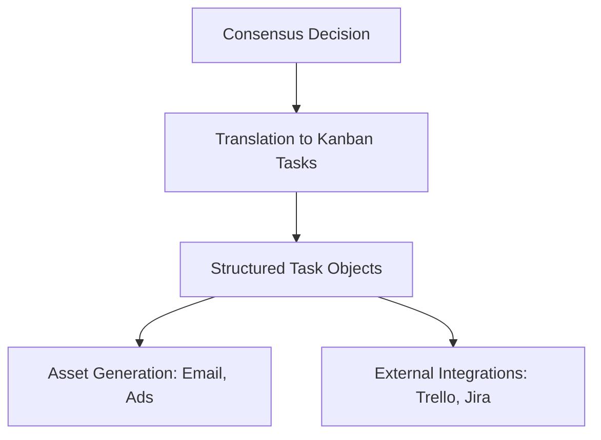

# Execution Engine: Workflow Planner & Asset Generator

The **Execution Engine** translates high-level strategic decisions from the Decision Engine into actionable, step-by-step tasks, automatically generating required assets (marketing copy, email scripts, landing page frameworks).

---

## ⚙️ Execution Pipeline

---

## 🛠️ Detailed Specifications

### 1. Kanban Task Generation
The system decomposes a strategy (e.g. "Launch cold outbound email campaign") into a set of sequential tasks, populating:
* **Task Title**: e.g., "Draft cold outreach sequences."
* **Owner Agent**: e.g., `sales`.
* **Action Steps**: Sub-tasks detailing requirements.
* **Context Assets**: Link to the auto-generated copywriting assets.

### 2. Auto-Asset Copywriting Engine
The system uses specialized prompt templates contextually loaded with the Digital Twin's value propositions and target audience parameters:
- **Email Sequences**: Generates 3-touchpoint cold emails utilizing specific copywriting frameworks (AIDA, PAS).
- **Ad Frameworks**: Creates ad headlines, body copy, and visual hooks structured for target platforms (Google, Meta).
- **Landing Page Structures**: Generates HTML wireframe mock layouts or markdown structures containing section titles, value headers, and Call to Actions.

### 3. Integration Hooks
- In the MVP, tasks are saved locally and rendered in a React Kanban Board.
- Future hooks are designed to push tasks directly to customer boards on Trello, Jira, or Slack workspaces via webhooks.
