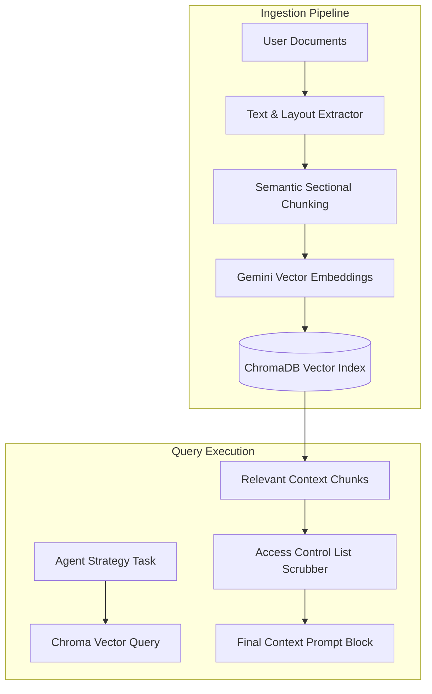

# Knowledge Layer (RAG): Contextual Retrieval Pipeline

The **Knowledge Layer** serves as the system's memory, indexing internal corporate files (pitch decks, strategy docs, financial statements) and external benchmarks (industry playbooks, marketing standards) to provide semantic context to the AI agents.

---

## ⚙️ Ingestion & Query Data Flow

---

## 🛠️ Detailed Specifications

### 1. Ingestion & Preprocessing
* **Text Extraction**: Runs PDF-to-Text and structural layout analysis. Special parsers handle tabular data, converting table rows into flat JSON lines for accurate vector parsing.
* **Semantic Sectional Chunking**: Standard RAG chunks at fixed character counts (e.g. 500 characters), which breaks up context. Our chunker identifies structural layout breaks (header tags, list boundaries) to split documents into logical segments.

### 2. Retrieval & Context Composition
When an agent is triggered (e.g. the CMO Agent building an ad campaign):
1. **Semantic Querying**: The system searches ChromaDB using cosine similarity matching.
2. **Access Control Filtering**: A metadata filter evaluates the query against the document's access level (e.g. `cfo` can retrieve finance tables, but `marketing` is blocked).
3. **Retrieval Composition**: Retrieved chunks are merged, ordered by relevance and date-metadata, and injected into the agent's system prompt context.
