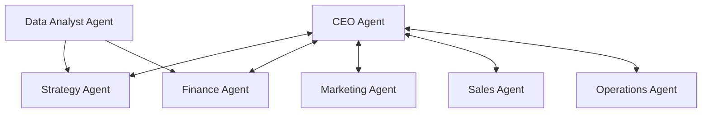

# Multi-Agent Architecture: The Autonomous Executive Board

The core intelligence of the Business Growth Operating System (BGOS) is organized as a virtual executive board of specialized AI agents. Rather than running isolated queries, these agents collaborate, challenge each other, and resolve operational conflicts.

---

## 👥 Agent Matrix

---

## 🔍 Detailed Agent Specifications

### 1. CEO Agent (Chief Executive Officer)
* **Role**: Orchestrates the executive board, manages consensus, and drives final strategic selections.
* **Responsibilities**:
  - Distributes strategic goals to specialized agents.
  - Reviews and aggregates department strategies.
  - Resolves conflicts between department proposals.
* **Inputs**: Unified Digital Twin state, user preferences, department recommendations.
* **Outputs**: Consolidated growth initiatives, final execution directives.
* **Decision Power**: **Primary**. Can override department proposals if consensus fails.

### 2. Strategy Agent (Chief Strategy Officer)
* **Role**: Formulates high-level growth strategies and coordinates market positioning.
* **Responsibilities**:
  - Compares the business model against external playbooks.
  - Recommends monetization strategies and positioning changes.
* **Inputs**: Competitor profiles, business ontology, market benchmarks.
* **Outputs**: Core growth initiatives, strategic positioning proposals.
* **Decision Power**: Strategic recommender; requires CEO validation.

### 3. Marketing Agent (Chief Marketing Officer)
* **Role**: Develops customer acquisition and campaign strategies.
* **Responsibilities**:
  - Identifies target customer acquisition channels.
  - Formulates budget allocations and marketing campaigns.
* **Inputs**: Customer segment parameters, CAC records, target audience profiles.
* **Outputs**: Proposed ad budget distributions, campaign landing page structures, and copy templates.
* **Decision Power**: Execution recommender; budget changes must be approved by the Finance Agent.

### 4. Finance Agent (Chief Financial Officer)
* **Role**: Guards unit economics, margins, and burn rate boundaries.
* **Responsibilities**:
  - Reviews marketing budgets against Cash reserves and gross margins.
  - Runs cash runway simulations.
* **Inputs**: Gross margins, current cash reserves, proposed expenses.
* **Outputs**: Budget approvals/rejections, financial risk indicators.
* **Decision Power**: **Veto Power** over marketing budgets if spend violates margin bounds.

### 5. Sales Agent (Chief Revenue Officer)
* **Role**: Designs sales pipelines and outbound outreach cadences.
* **Responsibilities**:
  - Outlines sales rep allocations, average deal cycle targets, and close ratios.
  - Generates sales pitches, cold outreach structures, and script outlines.
* **Inputs**: Product specs, pricing models, target buyer personas.
* **Outputs**: Sales outreach playbooks, CRM funnel stage structures.
* **Decision Power**: Execution designer.

### 6. Operations Agent (Chief Operating Officer)
* **Role**: Identifies bottleneck constraints and aligns resources.
* **Responsibilities**:
  - Validates if the organization has the headcount and tech stack to execute the plan.
* **Inputs**: Team capacity metrics, software/tech stack indicators.
* **Outputs**: Operational feasibility scores, capacity alerts.
* **Decision Power**: Feasibility advisor.

### 7. Data Analyst Agent
* **Role**: Queries telemetry data and validates performance.
* **Responsibilities**:
  - Analyzes version history of the Digital Twin to evaluate campaign success.
  - Flags anomalies in business KPIs.
* **Inputs**: Live database metrics, twin history snapshots.
* **Outputs**: Analytics reports, performance logs.
* **Decision Power**: Non-executive analytical validator.
