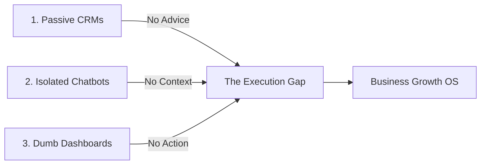

# Problem Analysis: Why Modern Business Growth Tools Fail

To build a billion-dollar enterprise product, we must first deeply understand the structural weaknesses of the existing SaaS and AI landscape. Most modern growth solutions fall into three main traps: **Passive Record Keeping**, **Black-Box Chatbots**, and the **Execution Gap**.

---

## 🚫 The Three Operational Gaps

### 1. Passive Record Keeping (The CRM Trap)
Traditional CRMs (Salesforce, HubSpot) are passive databases. They are excellent at recording what *has happened* (pipeline value, closed deals, contact details), but they cannot formulate growth strategies. They place the analytical burden entirely on the human user, acting as digital filing cabinets rather than proactive strategic partners.

### 2. Isolated Chatbots (The Prompt Trap)
Placing generic LLM chat windows inside a CRM or operational portal does not solve business strategy.
- **Context Fragmentation**: Chatbots lack a structured understanding of the company's unit economics, operational boundaries, and competitor history.
- **Hallucinated Action Plans**: Lacking verification constraints, chatbots output generic, uncalibrated advice (e.g. "Increase marketing spend by 50%" to a bootstrapped company with low cash reserves).

### 3. Dumb Dashboards (The Visualization Trap)
Standard Business Intelligence (BI) dashboards show charts without action directives. A user sees that churn is rising, but the dashboard does not answer **"What should I do next?"** or auto-coordinate the departments to resolve it.

---

## ⚡ The BGOS Solution Architecture

BGOS resolves these limitations through:
- **Active Reasoning**: Multiple agents represent different departments (CFO, CMO, Strategy) and actively debate strategies before presenting them.
- **Explainable Evidence**: Recommendations are accompanied by a structured data profile detailing logic, confidence metrics, and potential alternatives.
- **Structured Execution**: Rather than outputting abstract advice, the system generates ready-to-execute Kanban task lists and content.
