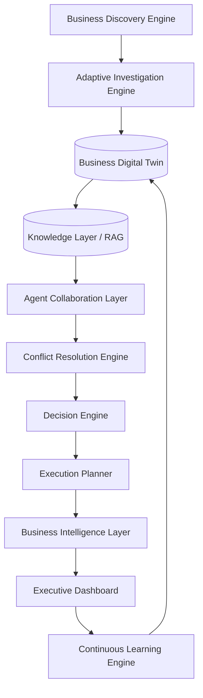

# Project Overview: Business Growth Operating System (BGOS)

The **Business Growth Operating System (BGOS)** is a dynamic, multi-agent AI ecosystem designed to act as an autonomous board of directors for enterprise growth. It sits above traditional operational tools (CRMs, ERPs, analytics databases) to provide strategic, explainable decision-making and automated workflow orchestration.

---

## 🎯 Value Proposition

For growth-focused enterprises and startups:
- **Unified Growth Intelligence**: Replaces fragmented dashboards with an executive board of specialized AI agents.
- **Deep Context Alignment**: Builds a high-fidelity **Business Digital Twin** mapping operations, unit economics, and constraints rather than isolated prompts.
- **Explainable Decisions**: Never outputs black-box advice. Every action plan is accompanied by structured evidence, specific operational assumptions, confidence intervals, and alternative strategies.
- **Continuous Parameter Refinement**: Telemetry from executed actions flows back into the Digital Twin, creating a self-improving strategic loop.

---

## 🧩 Core Architecture Core Modules

The system is designed as a series of cascading intelligence layers:

---

## 💼 Operational Scenarios & Targets

1. **Strategic Refinement**: Identifying high-leverage growth channels (e.g. pivoting from direct sales to product-led growth).
2. **Pricing Optimization**: Simulating pricing changes across margin constraints and competitor benchmarks to maximize LTV.
3. **Execution Delivery**: Generating step-by-step task boards with ready-to-run copy, email cadences, and ad structures.
