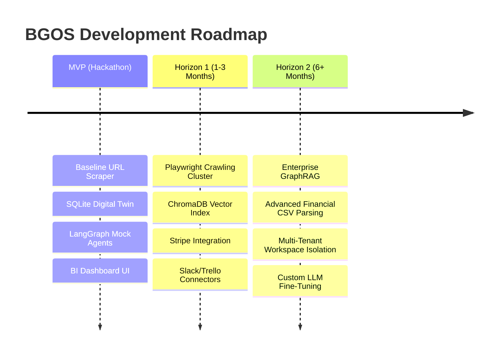

# Product Roadmap: BGOS Growth Trajectory

This document defines the conceptual timeline, feature releases, and technical phases of the Business Growth Operating System (BGOS), spanning from the 24-hour hackathon to a scaled enterprise SaaS.

---

## 🗺️ Execution Horizons

---

## 🛠️ Detailed Horizons Plan

### 🚀 MVP (24-Hour Hackathon)
* **Goal**: Establish the end-to-end framework flow from discovery to execution planning with high demo polish.
* **Scope**:
  - Request-based website scraping and Gemini-powered baseline ontology mapping.
  - 3-question adaptive interview to resolve core business parameters.
  - Multi-agent LangGraph workflow featuring CEO, Strategy, and Finance agent roles.
  - React/Tailwind frontend showing dashboard metrics and execution Kanban boards.

### 📈 Horizon 1 (Near-Term Launch)
* **Goal**: Refine extraction engines, enhance integrations, and prepare for initial customers.
* **Scope**:
  - Implement browser-based dynamic crawlers (Playwright) to bypass Cloudflare protection.
  - Introduce full vector-based RAG storage mapping uploaded corporate documents.
  - Connect task boards directly to user accounts via Slack, Trello, or Jira APIs.
  - Establish payment gating (Stripe) and subscription plans.

### 🏢 Horizon 2 (Enterprise Scale)
* **Goal**: Maximize system reasoning capacity and support complex enterprise configurations.
* **Scope**:
  - Build GraphRAG indexing systems mapping entities and relationships.
  - Add secure, encrypted financial integration parsing live ledger data (QuickBooks, Xero).
  - Fine-tune custom LLM models on proprietary operational playbooks.
  - Achieve full multi-tenant schema isolation and compliance certifications (SOC2).
