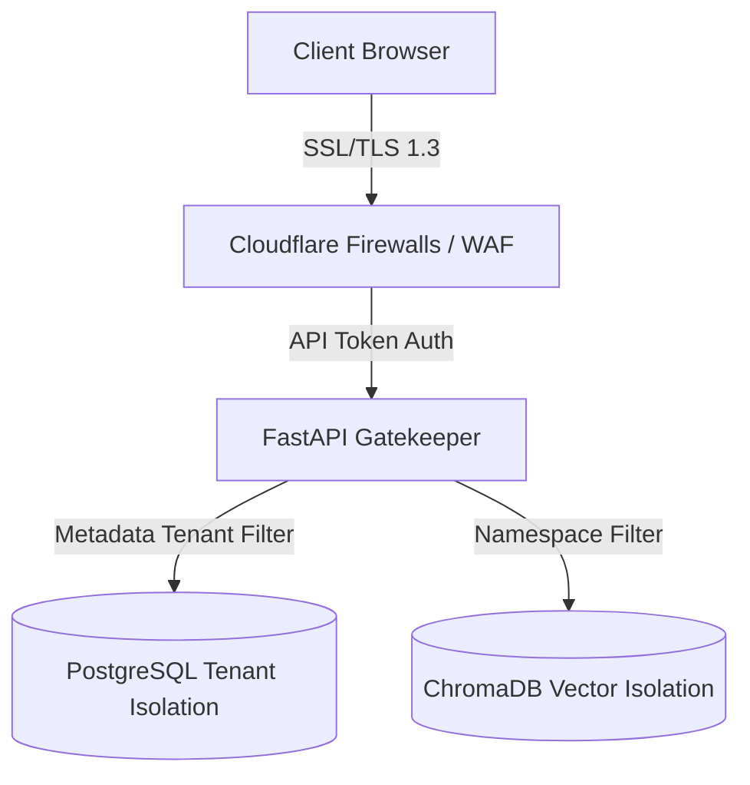

# Security Architecture: Enterprise Integrity

As an operating system handling strategic and proprietary corporate metrics (margins, runways, target positioning), security is integrated into every layer of the BGOS platform.

---

## 🏛️ Security Scopes

---

## 🛠️ Security Enforcement Specifications

### 1. Data Isolation & Multi-Tenancy
- **Logical Schema Partitioning**: Every database query must filter on `tenant_id` or `business_id` derived directly from the user's validated JWT token. Raw client inputs are never trusted to specify tenant identities.
- **Vector Space Partitioning**: Document embeddings are saved in isolated collection namespaces in ChromaDB/Pinecone to prevent cross-tenant retrieval leakage during RAG queries.

### 2. Encryption Standards
- **In Transit**: All HTTP requests enforce **SSL/TLS 1.3** redirection.
- **At Rest**: PostgreSQL directories utilize **AES-256** filesystem level encryption. Sensitive parameters inside database JSON fields (e.g. precise salary metrics) are double-encrypted using application-level cryptographic keys.

### 3. PII & Sensitive Token Redaction
- Before parsing raw scraped websites or user-uploaded strategy PDFs:
  - Text runs through a local pattern matching utility (regex/NER) to replace physical addresses, credit card values, and personal contact lines with anonymization tokens (e.g., `[REDACTED_EMAIL]`).
  - Raw client inputs are scrubbed before being passed to external Gemini API models.
