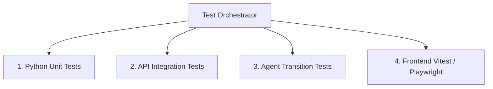

# Testing Strategy: Verification Framework

This document outlines the testing methodologies, tools, and execution pipelines used to verify the code quality and logic consistency of the Business Growth Operating System (BGOS).

---

## 🏗️ Testing Architecture



---

## 🛠️ Testing Scopes & Execution Commands

### 1. Python Unit Testing (FastAPI Backend)
We utilize `pytest` to verify core algorithms, scrapers, and database operations.
* **Command**:
  ```bash
  pytest tests/unit/
  ```
* **Coverage Targets**:
  - HTML scraping parsing and conversion to clean markdown.
  - Baseline business profile parsing and classification matching.
  - Zod/Pydantic validation checks on model input configurations.

### 2. API Integration Testing
Validates complete client-server HTTP call flows using FastAPI's `TestClient` framework:
- Verifying authentication gates block unauthorized requests.
- Simulating discovery submissions to confirm correct response schemas.

### 3. Agentic Workflow Testing (LangGraph Verification)
To verify agent logic without incurring LLM cost or latency:
- **Mock LLM Providers**: We write mock adapters returning predefined responses (e.g. mock CFO proposals or mock CMO campaigns).
- **State Transition Assertions**: Assert that the state machine correctly transitions nodes (e.g., verifying that a budget veto correctly loops back to the planning node instead of progressing to the execution board).
