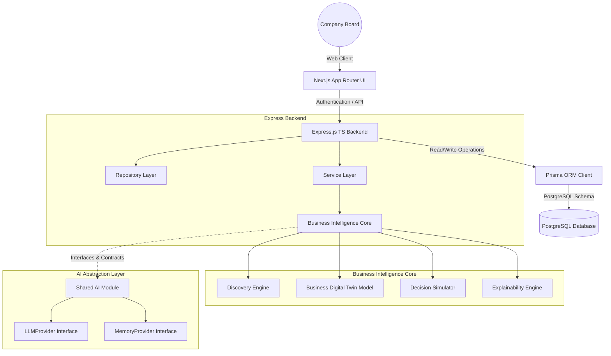

# System Architecture: AI Business Growth Operating System

This document outlines the visual structure, subsystems, and execution flows within the Operating System.

## Visual Subsystems Model

## Core Architectural Layers

1. **Presentation Layer (Frontend)**: Next.js latest App Router, React, Tailwind CSS, and Lucide icons.
2. **Business API Layer (Backend)**: Express.js TypeScript server exposing clean REST endpoints, validated using Zod, logged with Winston, and tracked via Request Correlation IDs.
3. **Database Repository Layer**: Prisma ORM client abstracting raw queries to a PostgreSQL instance.
4. **AI Abstraction Layer**: Pure TypeScript contracts (`/ai`) providing standard data models for Agents, debate rounds, predictions, memory stores, and LLM communication.
