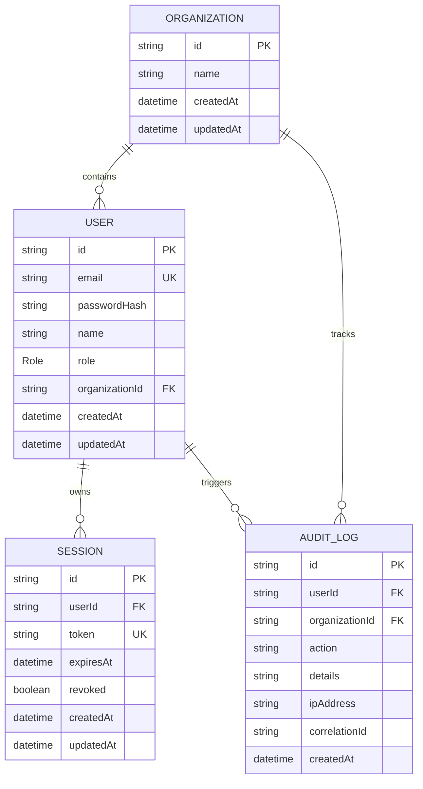

# Database Schema & Relations

This document details the PostgreSQL models generated via Prisma ORM for User management, tenant Organization allocation, Active sessions, and Audit logs.

## Model Schema Relationships

## Enum Definitions
- **`Role`**:
  - `OWNER`: Workspace root/billing admin.
  - `ADMIN`: User management and settings manager.
  - `MANAGER`: Operations manager, simulation reviewer.
  - `MEMBER`: Read-only viewer, document uploader.
